# Poplux — Low-Level Design

Companion to [DESIGN.md](DESIGN.md). Covers internal structure: classes, data flow, runtime collaboration, and per-frame execution order.

---

## 1. Module Dependency Graph

Arrow means "imports from".

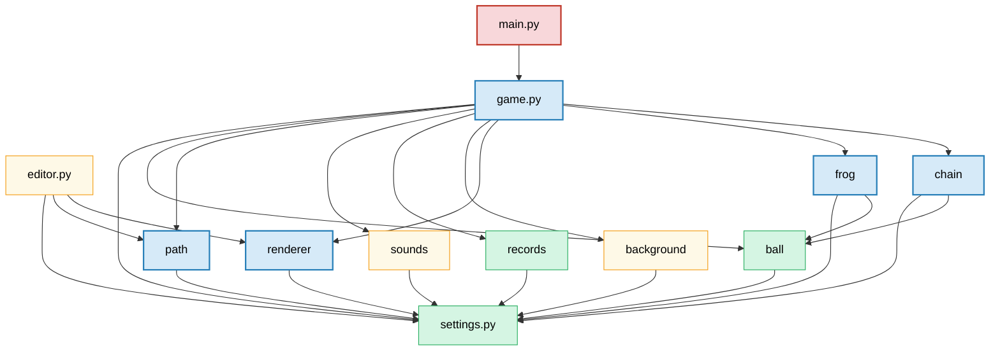

`settings.py` is a leaf — imported by all, imports nothing. All modules use it for constants (`BALL_RADIUS`, `FPS`, level configs) and the `SETTINGS` singleton.

---

## 2. Class Diagrams

### 2a. Core Simulation

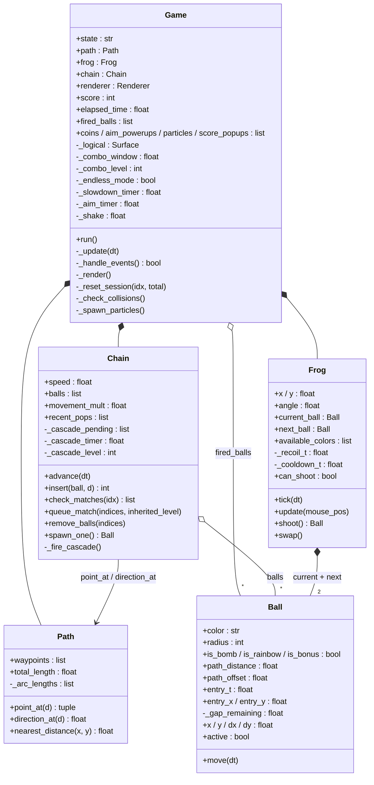

> **Ball dual-role:** `path_distance / path_offset / entry_t / _gap_remaining` are chain-role fields; `x / y / dx / dy / active` are fired-role fields. The same object transitions from fired → chain on `Chain.insert()`. `entry_t` goes 0→1 during insertion animation (`< 1` = still animating in); `path_offset` is a visual displacement animated to 0 after insertion.

### 2b. Visual & Ephemeral

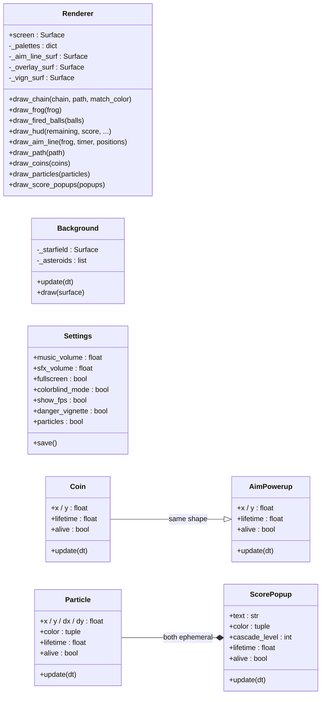

> `Renderer` and `Background` never mutate game entities. Ephemeral lists are pruned each frame via `[x for x in xs if x.alive]`.

---

## 3. State Machine

`Game.state` is a string. `_set_state()` drives overlay-fade transitions; direct assignment is used for instant transitions.

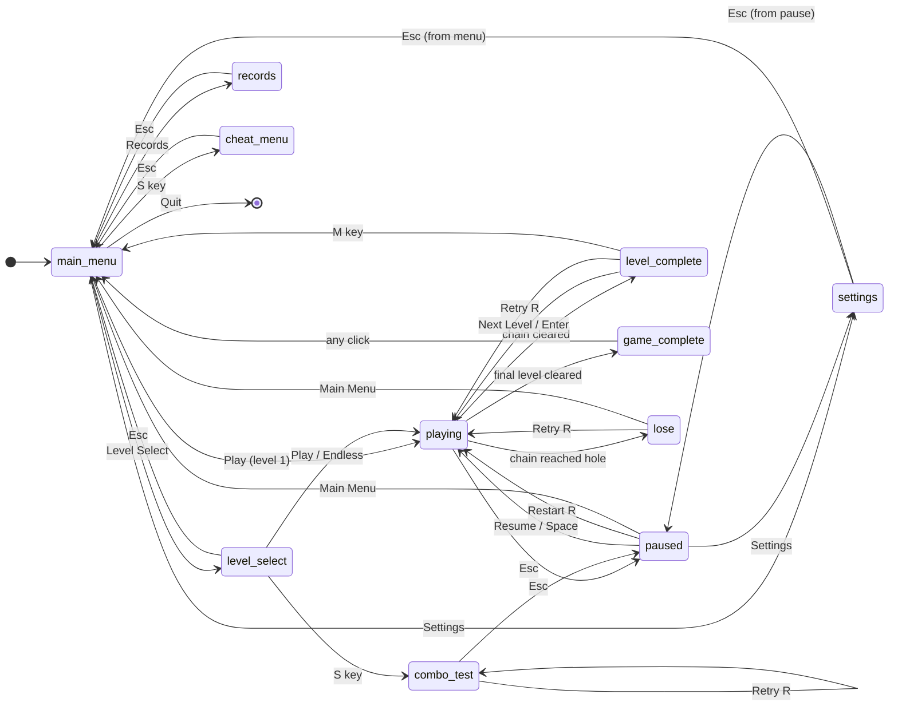

`_settings_return_state` stores where settings was opened from. `_pre_pause_state` stores `"playing"` or `"combo_test"` so restart works from either.

---

## 4. Per-Frame Update Order

Single tick at 60 Hz. All work runs on the main thread in this order:

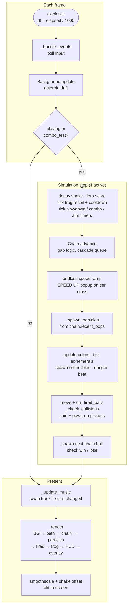

**Invariants:** `Chain.advance()` runs before `_check_collisions` (uses current-frame positions). `recent_pops` is cleared at the top of `advance()`, so `_spawn_particles` always reads current-frame pops.

---

## 5. Chain Internals

### 5.1 Ball Array Layout

```
Index:   [0]     [1]     [2]     [3]     [4]     [5]
         rear ◄────────────────────────────► front
         (spawn)                             (hole)

dist:     0     dia    2·dia   2·dia   3·dia   4·dia
                                ↑
                        _gap_remaining > 0 (just inserted)
```

`balls[0]` = smallest path_distance (spawn side). `balls[-1]` = largest (hole side, triggers lose).

### 5.2 Gap State Machine

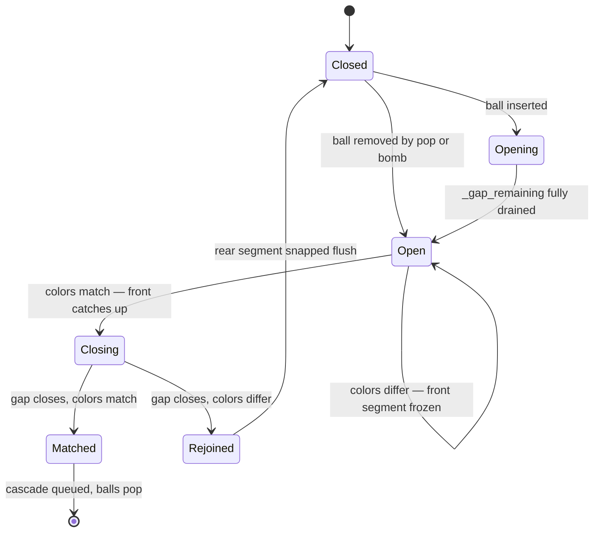

### 5.3 advance(dt) Flow

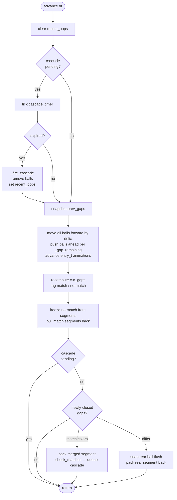

### 5.4 Insertion + Cross-Shot Combo

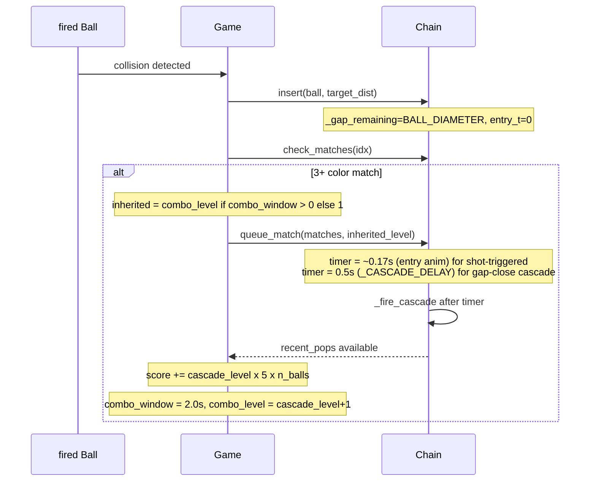

If the next shot lands within 2 s, `inherited_level` carries the bumped level forward.

---

## 6. Path — Spline Pipeline

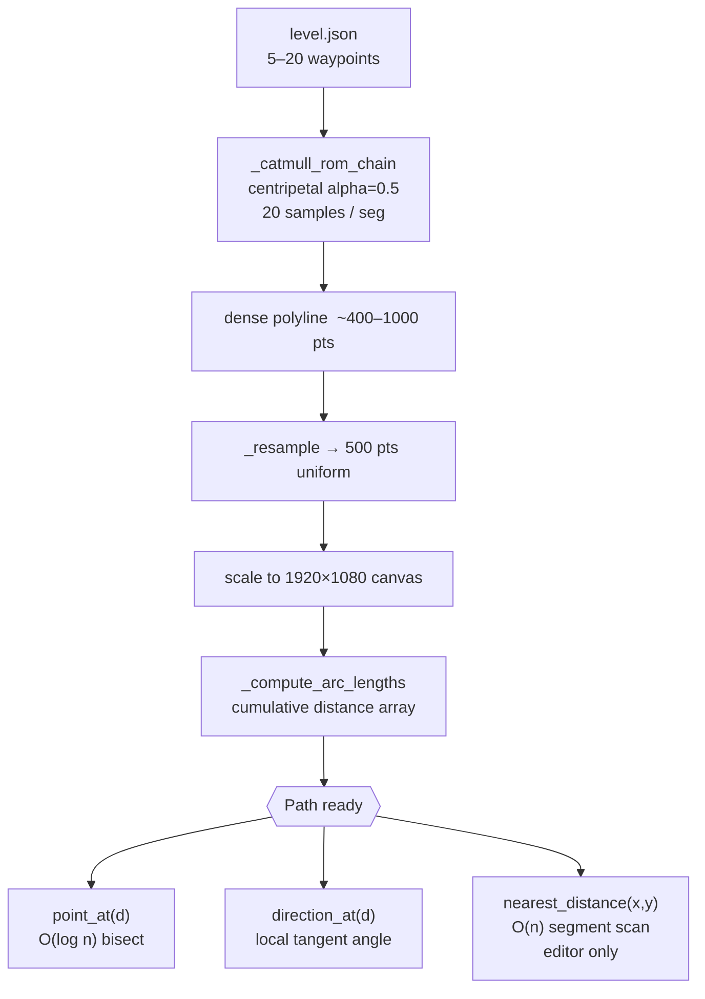

Centripetal CR (alpha=0.5) avoids cusps. Phantom endpoint duplication forces the curve through all authored waypoints.

---

## 7. Frog — Shot Pipeline

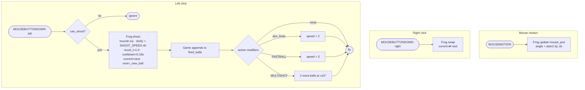

**`_new_ball()` draw:**  `r < 0.05` → bomb · `r < 0.10` → rainbow · else → random color from `available_colors`.

---

## 8. Rendering Pipeline

```mermaid
flowchart TD
    A([_render]) --> B["Background<br/>starfield + asteroids"]
    B --> C{game state}
    C -->|"menu / records / settings"| D["draw appropriate screen"]
    C -->|gameplay| E["draw_path<br/>tube + pulsing hole"]

    E --> F["draw_coins · draw_aim_powerups"]
    F --> G["draw_chain<br/>bonus ring · match ring · ball layers"]
    G --> H["draw_particles · draw_score_popups"]
    H --> I["draw_fired_balls"]
    I --> J["draw_aim_line  (if aim_timer > 0)"]
    J --> K["draw_frog"]
    K --> L["draw_hud<br/>vignette · score · timer · endless speed · bars"]
    L --> N{overlay?}

    OUT(["smoothscale + shake offset + blit"])

    N -->|paused| P1["draw_pause_menu"] --> OUT
    N -->|level_complete| P2["draw_level_complete"] --> OUT
    N -->|game_complete| P3["draw_game_complete"] --> OUT
    N -->|lose| P4["draw_lose"] --> OUT
    N -->|none| OUT
    D --> OUT
```

**Surface inventory:**

| Surface | Purpose | Lifetime |
|---|---|---|
| `_logical` | 1920×1080 draw canvas | Per session |
| `_aim_line_surf` | SRCALPHA, cleared each frame | Allocated once |
| `_overlay_surf` | SRCALPHA for menu backdrops | Allocated once |
| `_vign_surf` | SRCALPHA red vignette, alpha re-scaled per frame | Allocated once |

---

## 9. Persistence

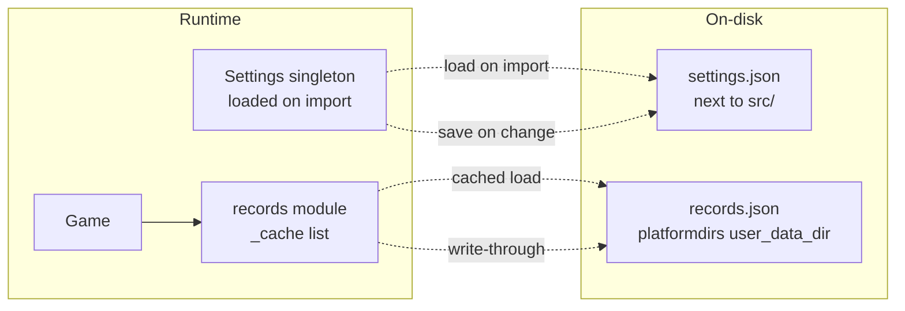

**Record schema:** `{ "level": "The Spiral", "score": 1840, "time": 87.4, "date": "2026-05-21" }`

Endless runs use key prefix `"Endless (Lvl N)"`. `top()` vs `top_endless()` split them at query time.

---

## 10. Sound System

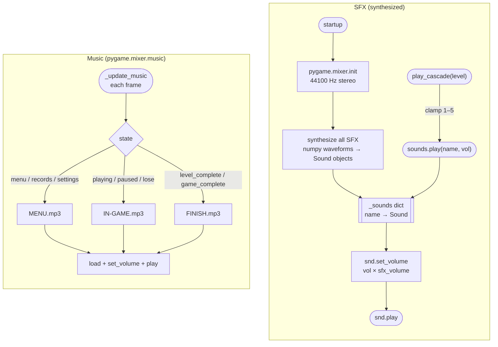

`cascade_1`–`cascade_5` are pre-generated at startup, each a perfect fourth higher than the last.

---

## 11. Coordinate Spaces

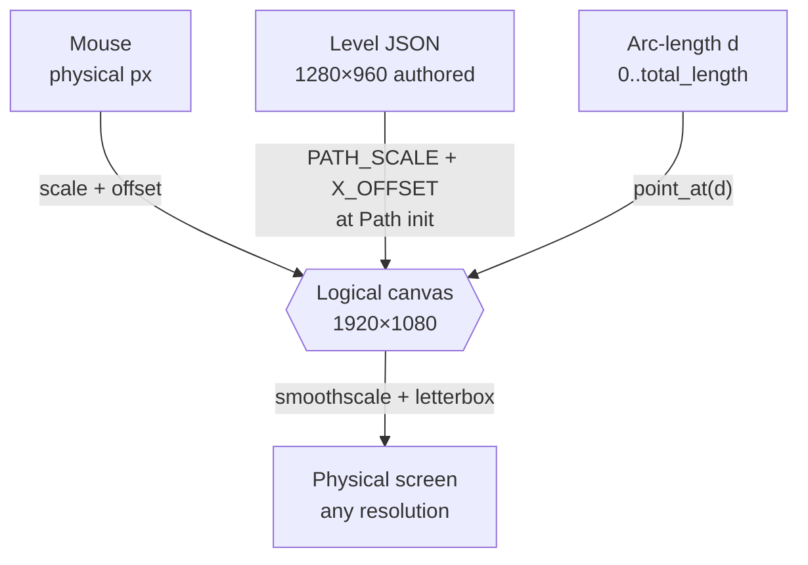

| Space | Range | Where used |
|---|---|---|
| Authored | 0–1280 × 0–960 | Level JSON, editor |
| Logical | 0–1920 × 0–1080 | All game math, rendering, collision |
| Arc-length | 0–total_length | Chain ball positions |
| Physical | display resolution | Final blit only |

---

## 12. Cheat & Powerup Hooks

| Effect | Source | Hook point | What changes |
|---|---|---|---|
| GODMODE | cheat menu | `_update` end of frame | Balls past path end removed instead of loss |
| SLOWMO | cheat menu | `chain.advance` call | `advance(dt * 0.25)` |
| MAGNET | cheat menu | before fired ball move | `dx/dy` steered toward nearest chain ball |
| FASTBALL | cheat menu | shoot in event loop | `ball.dx/dy *= 3` |
| MULTISHOT | cheat menu | shoot in event loop | 2 extra balls at ±15° |
| RAINBOW | cheat menu | `_check_collisions` on hit | `fired.color = chain_ball.color` before insert |
| Aim powerup | pickup collision | shoot in event loop | `ball.dx/dy *= 2` while `_aim_timer > 0` |
| Slowdown | bonus ball pop | `_update` each frame | `chain.movement_mult = 0.35` while `_slowdown_timer > 0` |
| Cross-shot combo | any pop | `queue_match` call | `inherited_level = combo_level` if window open |

Cheats are `set[str]` in `Game.active_cheats`; each hook does a simple `"CHEAT" in self.active_cheats` check.

---

## 13. Test Layout

```
tests/
├── test_chain_catchup.py    gap closing, freeze/catch-up, match-on-close
├── test_chain_insert.py     insertion ordering, _gap_remaining animation
└── test_frog.py             cooldown, recoil, swap, color pool refresh
```

Tests run headless — `Path` uses a straight two-point waypoint list; `Chain` and `Frog` need no display surface. Tests assert `path_distance` invariants after sequences of `insert()` and `advance()` calls.

---

## 14. Threading Model

Single-threaded. `pygame.mixer` manages its own audio thread; all simulation, rendering, input, and file I/O run synchronously on the main thread.

At 60 Hz the frame budget is 16.7 ms. The heaviest per-frame operations (chain advance, collision scan, `smoothscale`) each take well under 1 ms on typical hardware. Records write to disk only at level end or loss — no I/O in the hot path.
